# 02 — Database Schema

PostgreSQL 15 (Supabase). All tables in `public`; helper functions in schema `app`.

## Conventions (enforced by a migration-lint script)

- `id uuid primary key default gen_random_uuid()`
- `created_at timestamptz not null default now()`, `updated_at timestamptz not null default now()` (trigger `set_updated_at`)
- `created_by uuid references profiles(id)`, `updated_by uuid`
- `organization_id uuid references organizations(id)` on every org-scopable table (nullable = independent family record)
- Soft delete: `deleted_at timestamptz`, `deleted_by uuid`. Educational records are **never hard-deleted** by user action (§39). All read policies filter `deleted_at is null`.
- **Legal/calendar dates are `date`, not `timestamptz`** (a Notice of Intent filed "September 3" must not shift by timezone). Instants (`created_at`, event start/end) are `timestamptz`; every org and family carries a `timezone` (IANA) used for rendering.
- Enums are Postgres enum types in schema `app` (`app.access_level`, `app.org_role`, `app.status`, …) so a typo is a migration error, not a runtime bug.
- Every FK is indexed. Every `(organization_id, <hot column>)` and `(student_id, <date>)` access path is indexed.
- RLS is `enable row level security` + `force row level security` on **every** table. A table with no policy is inaccessible by default; the migration lint fails if a new table has RLS off.

## 2.1 Identity & tenancy

**profiles** — 1:1 with `auth.users`. `id` (= auth uid), `email`, `full_name`, `preferred_name`, `avatar_url`, `phone`, `locale` (`en`/`es`), `timezone`, `is_super_admin bool default false`, `onboarding_state jsonb`, `last_seen_at`.

**organizations** — `name`, `slug unique`, `type` (`microschool|support_program|coop|tutoring|evaluation_practice|other`), `state_code`, `county`, `timezone`, `branding jsonb`, `settings jsonb`, `compliance_pack_id`, `status`, `plan` (placeholder for billing).

**organization_locations** — `organization_id`, `name`, `address_*`, `timezone`, `capacity`, `is_primary`.

**organization_members** — `organization_id`, `user_id`, `role app.org_role` (`org_admin|teacher|tutor|staff|evaluator`), `status` (`invited|active|suspended|removed`), `location_ids uuid[]`, `title`, `invited_by`, `joined_at`.
Unique `(organization_id, user_id, role)`. Index `(user_id) where status='active'`.

**invitations** — `organization_id`, `email`, `role`, `token_hash`, `expires_at`, `accepted_at`, `invited_by`, `payload jsonb` (pre-linked student/family). Tokens are stored hashed; the raw token exists only in the email.

**families** — `name`, `primary_guardian_id`, `state_code`, `county`, `timezone`, `homeschool_start_date`, `is_independent bool`, `settings jsonb`. A family exists even for org-affiliated students — **the family owns the student record; the org holds a revocable membership.**

**family_members** — `family_id`, `user_id`, `role` (`guardian|adult|student`), `is_primary`.

**organization_memberships** *(family ↔ org link)* — `organization_id`, `family_id`, `status` (`pending|active|paused|ended`), `started_on`, `ended_on`, `data_sharing jsonb` (which sections the family shares with the org). When it ends, org access to those students ends; the family keeps everything.

## 2.2 Students

**students** — `family_id` (not null), `organization_id` (nullable), `user_id` (nullable login), `legal_first_name`, `legal_last_name`, `preferred_name`, `date_of_birth date`, `grade_level` (text: `K`,`1`…`12`, `pre_k`, `ungraded`), `grade_equivalent jsonb`, `homeschool_start_date date`, `current_academic_year_id`, `state_code`, `county`, `photo_path`, `learning_preferences jsonb`, `support_needs jsonb`, `goals text`, `status` (`active|inactive|graduated|withdrawn`), `archived_at`.
Indexes: `(family_id)`, `(organization_id) where deleted_at is null`, `(status)`, trigram on names for search.

**student_guardians** — `student_id`, `user_id`, `relationship`, `is_primary`, `access_level` (`full|standard|view_only`), `is_emergency_contact`, `granted_by`, `revoked_at`, `revoked_by`. Unique `(student_id, user_id) where revoked_at is null`.

**student_staff_assignments** — `student_id`, `user_id`, `organization_id`, `role` (`teacher|tutor|specialist|case_manager`), `access_level` (`read|write`), `subjects uuid[]`, `starts_on`, `ends_on`, `active`, `granted_by`.

**student_access_grants** — temporary access (evaluators, visiting reviewers). `student_id`, `grantee_user_id`, `grantee_email` (pre-account), `kind` (`evaluation|review|transfer|support`), `sections jsonb` (`["portfolio","documents","progress"]`), `access_level`, `expires_at`, `status` (`pending|active|revoked|expired`), `granted_by`, `revoked_at`, `token_hash`.

**support_access_sessions** — break-glass super-admin access: `user_id`, `student_id` (nullable), `organization_id` (nullable), `reason text not null`, `expires_at`, `approved_by`.

**consents** — `subject_student_id`, `guardian_user_id`, `kind` (`student_account|ai_processing|org_data_sharing|photo_use`), `granted_at`, `revoked_at`, `evidence jsonb` (IP, UA, text version).

## 2.3 Academic core

**academic_years** — `organization_id` (nullable → family-level), `family_id` (nullable), `name` ("2026–2027"), `starts_on`, `ends_on`, `is_current`. Florida default: Aug 1 → Jul 31, configurable.

**subjects** — `organization_id` (nullable → global seed), `name`, `slug`, `category`, `color`, `icon`, `is_system bool`. Global rows are readable by everyone; org rows only by that org.

**skills** — `subject_id`, `parent_skill_id` (self-referential tree), `code`, `name`, `description`, `grade_band`, `framework` (`internal|state_standard|common_core|custom`), `framework_ref`, `sequence`, `is_system`. Indexed `(subject_id, parent_skill_id)`, plus `ltree` path column for fast subtree queries.

**student_skills** — the Skill Map (§17). `student_id`, `skill_id`, `mastery_level` (`not_started|introduced|developing|progressing|proficient|mastered`), `score numeric(5,2)` (0–100), `confidence` (`ai_suggested|self_reported|teacher_observed|assessment_confirmed`), `evidence_count`, `last_evidence_at`, `last_source_type`, `last_source_id`, `confirmed_by`, `confirmed_at`, `notes`.
Unique `(student_id, skill_id)`. **Constraint: `mastery_level = 'mastered'` requires `confidence in ('teacher_observed','assessment_confirmed')` and a non-null `confirmed_by`** — the DB refuses AI-only mastery (§17, §39).

**student_skill_events** — append-only history feeding the score: `student_skill_id`, `source_type` (`assessment|assignment|portfolio_item|observation|ai_analysis|manual`), `source_id`, `delta`, `score`, `confidence`, `created_by`. Progress trends (§19) are computed from this table, never from a mutable current value.

**classes** — `organization_id`, `location_id`, `name`, `subject_id`, `description`, `academic_year_id`, `capacity`, `age_min`, `age_max`, `schedule jsonb` (RRULE + time blocks), `type` (`class|pod|group|program|club|tutoring_group`), `status`.
**class_students** — `class_id`, `student_id`, `enrolled_on`, `ended_on`, `active`, `status`.
**class_staff** — `class_id`, `user_id`, `role` (`lead|assistant|substitute`), `active`.

**calendar_events** — `organization_id`, `family_id`, `location_id`, `class_id`, `lesson_id`, `title`, `description`, `type` (`class|lesson|tutoring|evaluation|field_trip|therapy|parent_meeting|staff_meeting|extracurricular|deadline|holiday|assessment|other`), `starts_at timestamptz`, `ends_on timestamptz`, `all_day bool`, `timezone`, `rrule text`, `recurrence_parent_id`, `exdates date[]`, `status` (`scheduled|cancelled|completed`), `visibility` (`family|class|org|public_org`), `created_by`.
**event_participants** — `event_id`, `student_id | user_id | class_id`, `role` (`attendee|owner|optional`), `response`.
Recurrence strategy: store the RRULE, **materialize instances into `calendar_event_instances`** for the current ±18 months via a job. Range queries hit the materialized table (indexed `(organization_id, starts_at)`, `(student_id, starts_at)`); this keeps day/week views to one index scan.

**lessons** — `organization_id`, `family_id`, `class_id`, `subject_id`, `academic_year_id`, `title`, `objective`, `duration_minutes`, `grade_level`, `difficulty`, `learning_style`, `materials jsonb`, `sections jsonb` (`warm_up|instruction|activity|differentiation|extension|assessment|homework`), `standards jsonb`, `skill_ids uuid[]`, `portfolio_recommendation text`, `status` (`draft|planned|in_progress|completed|archived`), `source` (`manual|ai_generated|ai_edited|template|duplicated`), `ai_generation_id`, `scheduled_for date`, `template_of_id`.
**lesson_students** — `lesson_id`, `student_id`, `status`, `completed_at`, `notes`.
**lesson_groups** — `lesson_id`, `class_id`.

**assignments** — `lesson_id`, `class_id`, `subject_id`, `title`, `instructions`, `due_on date`, `points_possible`, `assigned_by`, `status`.
**assignment_students** — `assignment_id`, `student_id`, `status`, `due_on` (per-student override).
**assignment_submissions** — `assignment_id`, `student_id`, `submitted_at`, `content`, `document_ids uuid[]`, `status` (`assigned|in_progress|submitted|graded|returned|excused`), `score`, `feedback`, `graded_by`, `graded_at`.

**assessments** — `student_id | class_id`, `subject_id`, `title`, `type` (`quiz|test|diagnostic|benchmark|standardized|observation`), `administered_on date`, `points_possible`, `skill_ids uuid[]`, `source_document_id`, `source` (`manual|ai_extracted`).
**assessment_results** — `assessment_id`, `student_id`, `score`, `points_earned`, `percentage`, `per_skill jsonb` (`[{skill_id, correct, total}]`), `notes`, `recorded_by`, `confidence`.

**attendance** — `student_id`, `class_id`, `event_instance_id`, `date date`, `status` (`present|absent|late|excused|virtual`), `minutes`, `notes`, `recorded_by`, `method` (`teacher|parent_checkin|self|system`). Unique `(student_id, date, coalesce(class_id, '0000…'))`. Attendance is **optional** for independent families — the family setting `attendance_enabled` drives whether it appears at all (§16).

## 2.4 Evidence: portfolio, activity, reading, documents

**portfolio_items** — `student_id`, `organization_id`, `academic_year_id`, `title`, `description`, `subject_id`, `skill_ids uuid[]`, `activity_type` (`worksheet|writing|project|experiment|art|reading|video|photo|assessment|field_trip|other`), `evidence_category` (`work_sample|assessment|observation|teacher_note|certificate|other`), `occurred_on date`, `document_ids uuid[]`, `source` (`manual|lesson|assignment|document_upload|ai_suggested`), `source_id`, `visibility`, `is_highlight bool`, `created_by`.
Index `(student_id, occurred_on desc)`, `(organization_id, occurred_on desc)`, GIN on `skill_ids`.

**activity_logs** — the §10 educational activity log. `student_id`, `date date`, `subject_id`, `activity_title`, `description`, `resources jsonb`, `materials text`, `duration_minutes`, `staff_user_id`, `skill_ids uuid[]`, `portfolio_item_id`, `source` (`manual|lesson|assignment|portfolio|reading_log|teacher_note`), `source_type`, `source_id`, `dedupe_key text`.
**Dedupe:** unique index on `(student_id, dedupe_key) where dedupe_key is not null`, where `dedupe_key = source_type || ':' || source_id`. Auto-generation from lessons/assignments/portfolio is idempotent by construction.

**reading_logs** — `student_id`, `book_title`, `author`, `isbn`, `started_on date`, `completed_on date`, `pages_read`, `chapters`, `total_pages`, `reading_type` (`independent|read_aloud|shared|audiobook`), `subject_id`, `notes`, `skill_ids uuid[]`, `rating smallint`, `source`, `source_document_id`, `minutes`.

**documents** — original files, never mutated (§8). `organization_id`, `family_id`, `student_id` (nullable until classified), `uploaded_by`, `storage_bucket`, `storage_path`, `original_filename`, `mime_type`, `byte_size`, `sha256`, `page_count`, `title`, `category` (`assessment|evaluation|lesson_plan|worksheet|certificate|report|receipt|notice_of_intent|correspondence|student_work|credential|other`), `subject_id`, `document_date date`, `academic_year_id`, `status` (`uploaded|scanning|quarantined|clean|processing|needs_review|filed|failed`), `scan_status` (`pending|clean|infected|error`), `visibility`, `is_official bool`, `retention_until date`, `legal_hold bool`, `source` (`upload|generated|evaluator|import`).
Unique `(family_id, sha256) where deleted_at is null` → duplicate upload detection.

**document_versions** — for generated/regenerated artifacts only; original uploads are immutable and never versioned.

**document_ai_analysis** — one row per analysis run. `document_id`, `provider`, `model`, `prompt_version`, `status`, `raw_response jsonb`, `extracted jsonb` (the structured payload from §8), `text_content text`, `ocr_used bool`, `confidence numeric`, `page_confidences jsonb`, `detected_entities jsonb`, `missing_fields jsonb`, `tokens_in`, `tokens_out`, `cost_cents`, `duration_ms`, `error`. **Extraction output is stored separately from the file and never written back onto it.**

## 2.5 The AI proposal layer

**ai_suggestions** — the human-in-the-loop spine (Spine 2). `organization_id`, `family_id`, `student_id`, `source_type` (`document|portfolio|assistant|progress_engine|compliance|lesson`), `source_id`, `kind` (`classify_document|create_portfolio_item|update_skill|create_activity_log|create_reading_log|create_assessment_result|update_learning_plan|file_compliance_doc|create_lesson`), `payload jsonb` (the exact write to perform), `rationale text`, `confidence numeric(4,3)`, `confidence_band` (`low|medium|high`), `status` (`pending|accepted|rejected|expired|superseded`), `requires_confirmation bool default true`, `decided_by`, `decided_at`, `applied_record_type`, `applied_record_id`, `edited_payload jsonb`.
Index `(student_id, status)`, `(organization_id, status, created_at desc)`.
**Applying a suggestion is a single server action**: validate payload against a Zod schema per `kind` → perform write → set `applied_record_id` → write `audit_logs` row with `source='ai_confirmed'`. Rejections are kept (they are the eval set).

**ai_interactions** — every assistant/pipeline call: `user_id`, `organization_id`, `student_ids uuid[]`, `feature` (`assistant|document_analysis|lesson_generator|weekly_report|daily_brief|progress_engine`), `provider`, `model`, `prompt_version`, `messages_hash`, `input_summary`, `output_summary`, `tokens_in/out`, `cost_cents`, `latency_ms`, `permission_scope jsonb` (exactly which student IDs the retrieval layer was allowed to see), `status`, `error`, `feedback` (`up|down|null`).

**ai_usage_counters** — `organization_id | family_id`, `period_start date`, `feature`, `calls`, `tokens`, `cost_cents` — for per-tenant budgets and abuse throttling.

**job_queue** — `kind`, `payload jsonb`, `run_after`, `attempts`, `max_attempts`, `status` (`queued|running|done|failed|dead`), `locked_by`, `locked_at`, `last_error`, `idempotency_key unique`.

## 2.6 Compliance

**compliance_packs** — `state_code`, `name`, `version`, `effective_from`, `effective_to`, `status` (`draft|active|deprecated`), `notes`, `published_by`.
**compliance_rules** — see `07-compliance-engine.md` for full field semantics. `pack_id`, `state_code`, `county`, `category`, `code`, `title`, `requirement_text`, `obligation_level` (`required|recommended|optional|unknown`), `applies_to jsonb`, `trigger jsonb`, `due_date_logic jsonb`, `required_fields jsonb`, `document_template_id`, `submission_method` (`email|mail|portal|in_person|none`), `submission_destination jsonb`, `authoritative_source_url`, `authority_citation`, `last_verified_on date`, `verified_by`, `active bool`, `admin_notes`, `retention jsonb`.
**compliance_requirements** — a rule instantiated for a scope: `rule_id`, `student_id`, `academic_year_id`, `status`, `due_on date`, `window_opens_on date`, `computed_at`, `computed_inputs jsonb` (why this due date — the audit trail of the calculation).
**student_compliance_records** — the precomputed per-student rollup the dashboard reads: `student_id`, `academic_year_id`, `overall_status` (`current|needs_attention|incomplete|overdue|unknown`), `by_category jsonb`, `next_due_on date`, `next_due_rule_id`, `open_items smallint`, `computed_at`. One row per `(student_id, academic_year_id)`.
**document_submissions** — `student_id`, `rule_id`, `requirement_id`, `document_id` (the generated PDF), `method`, `destination jsonb` (email/address actually used, snapshotted), `status` (`draft|ready|awaiting_confirmation|sent|delivered|acknowledged|failed|manual`), `prepared_by`, `approved_by`, `approved_at`, `sent_at`, `confirmation_document_id`, `confirmation_note`, `provider_message_id`, `idempotency_key`, `transmission_evidence jsonb` (SMTP response, timestamps, recipients).
**district_contacts** — `state_code`, `county`, `district_name`, `office_name`, `email`, `phone`, `address`, `portal_url`, `source_url`, `last_verified_on`, `verified_by`. Kept as data because these change and are the #1 source of a failed filing.

**evaluations** — `student_id`, `evaluator_user_id`, `organization_id`, `academic_year_id`, `requested_at`, `scheduled_for`, `method` (`portfolio_review|standardized_test|other`), `status` (`requested|accepted|scheduled|in_progress|submitted|parent_review|accepted_by_parent|declined|cancelled`), `notes`, `outcome` (`satisfactory|needs_discussion|other`), `outcome_narrative`, `evaluator_signature_id`, `credentials_document_id`, `report_document_id`, `parent_reviewed_at`, `shared_sections jsonb`, `access_grant_id`, `fee_cents` (future).
**evaluator_profiles** *(marketplace-ready, §25)* — `user_id`, `display_name`, `bio`, `credential_type`, `credential_number`, `credential_document_id`, `verification_status` (`unverified|pending|verified|rejected`), `verified_by`, `verified_on`, `subjects uuid[]`, `grade_levels text[]`, `languages text[]`, `service_areas jsonb` (states/counties), `modality` (`virtual|in_person|both`), `price_cents`, `availability jsonb`, `accepting_new bool`, `rating_avg`, `rating_count`, `approval_status`.
**evaluator_reviews** — `evaluator_user_id`, `family_id`, `rating`, `comment`, `status` (moderated).
**signatures** — `signer_user_id`, `subject_type`, `subject_id`, `method` (`typed|drawn|uploaded|provider`), `image_path`, `statement text`, `signed_at`, `ip`, `user_agent`, `hash` (of the signed payload) — tamper-evident without a full e-sign vendor in MVP.

## 2.7 Learning plan, reports, comms, ops

**learning_plans** — `student_id`, `academic_year_id`, `current_level jsonb`, `strengths`, `areas_of_need`, `learning_preferences`, `teacher_recommendations`, `parent_goals`, `status` (`draft|active|archived`), `review_on date`, `approved_by`, `approved_at`, `version int`.
**learning_goals** — `learning_plan_id`, `student_id`, `subject_id`, `skill_id`, `title`, `description`, `horizon` (`short_term|long_term`), `priority`, `target_date`, `status` (`proposed|active|achieved|paused|dropped`), `progress smallint`, `source` (`parent|teacher|ai_suggested`), `approved_by`.
**teacher_notes** — `student_id`, `author_user_id`, `body`, `visibility` (`private_to_author|staff|family|all`), `subject_id`, `occurred_on`, `tags text[]`.

**message_threads** — `organization_id`, `family_id`, `student_id`, `subject`, `type` (`direct|class|org_announcement|evaluation|support`), `class_id`, `created_by`, `last_message_at`, `status`.
**message_thread_participants** — `thread_id`, `user_id`, `role`, `muted`, `last_read_at`. Check constraint: a thread containing a minor participant must contain ≥1 guardian of that minor or be `type='class'`.
**messages** — `thread_id`, `sender_user_id`, `body`, `attachments jsonb` (document ids), `sent_at`, `edited_at`, `deleted_at`, `system_kind`.
**announcements** — `organization_id`, `audience jsonb` (roles/classes/locations), `title`, `body`, `publish_at`, `expires_at`, `created_by`.

**notifications** — `user_id`, `type` (§29 list as enum), `title`, `body`, `data jsonb`, `link`, `priority`, `read_at`, `channels_sent jsonb`, `dedupe_key`, `expires_at`.
**notification_preferences** — `user_id`, `type`, `in_app bool`, `email bool`, `push bool`, `digest` (`immediate|daily|weekly|off`), `quiet_hours jsonb`.

**reports** — `student_id | organization_id`, `kind` (`student_progress|portfolio|activity_log|reading_log|attendance|skill|learning_plan|annual_portfolio|org_student_summary|teacher_caseload|compliance_status|weekly_home_report`), `period_start`, `period_end`, `parameters jsonb`, `status` (`queued|generating|ready|failed`), `document_id` (rendered PDF), `data_snapshot jsonb` (so a shared report never silently changes), `generated_by`, `shared_with jsonb`, `share_token_hash`, `share_expires_at`.

**audit_logs** — `organization_id`, `actor_user_id`, `actor_role`, `action` (enum, §32 list), `subject_type`, `subject_id`, `student_id`, `ip inet`, `user_agent`, `metadata jsonb`, `created_at`. Append-only: no update/delete policy exists for anyone, including super admin. Partitioned monthly by `created_at`. Index `(student_id, created_at desc)`, `(organization_id, created_at desc)`, `(actor_user_id, created_at desc)`.

**user_permissions** — targeted overrides beyond role defaults: `user_id`, `scope_type` (`organization|family|student|class`), `scope_id`, `permission` (text key, e.g. `documents.view`), `effect` (`allow|deny`), `granted_by`, `expires_at`. `deny` always wins. Used sparingly; the base roles cover ~95% of cases.

## 2.8 Indexing summary (the ones that matter)

```
students             (family_id) · (organization_id) where deleted_at is null · gin(trgm) names
student_guardians    (user_id) where revoked_at is null · (student_id)
student_staff_assign (user_id, active) · (student_id, active)
class_students       (student_id, active) · (class_id, active)
calendar_event_inst  (organization_id, starts_at) · (student_id, starts_at) · (family_id, starts_at)
portfolio_items      (student_id, occurred_on desc) · gin(skill_ids)
activity_logs        (student_id, date desc) · unique(student_id, dedupe_key)
documents            (student_id, document_date desc) · (status) where status<>'filed' · unique(family_id, sha256)
ai_suggestions       (student_id, status) · (organization_id, status, created_at desc)
student_compliance   unique(student_id, academic_year_id) · (next_due_on) where overall_status<>'current'
messages             (thread_id, sent_at desc)
notifications        (user_id, read_at nulls first, created_at desc)
audit_logs           monthly partitions + the three indexes above
```

## 2.9 Migration hygiene

- One concern per migration; filename `NNNN_verb_object.sql`; every migration has a matching `tests/rls/NNNN_*.sql` pgTAP test where it adds a policy.
- Seeds split: `supabase/seed/system/` (subjects, skills, compliance packs, district contacts — ships to production) vs `supabase/seed/dev/` (fake families — **never** loaded in production; guarded by an env check in the seed script, §38).

## 2.10 Entity relationships (core spine)

```mermaid
erDiagram
  PROFILES ||--o{ ORGANIZATION_MEMBERS : "belongs to orgs as"
  PROFILES ||--o{ STUDENT_GUARDIANS : guardians
  PROFILES ||--o{ STUDENT_STAFF_ASSIGNMENTS : "assigned to"
  PROFILES ||--o| EVALUATOR_PROFILES : "may be"
  ORGANIZATIONS ||--o{ ORGANIZATION_LOCATIONS : has
  ORGANIZATIONS ||--o{ ORGANIZATION_MEMBERS : has
  ORGANIZATIONS ||--o{ ORGANIZATION_MEMBERSHIPS : "enrolls families"
  ORGANIZATIONS ||--o{ CLASSES : offers
  FAMILIES ||--o{ STUDENTS : owns
  FAMILIES ||--o{ FAMILY_MEMBERS : has
  FAMILIES ||--o{ ORGANIZATION_MEMBERSHIPS : "joins orgs via"
  STUDENTS ||--o{ STUDENT_GUARDIANS : "accessed by"
  STUDENTS ||--o{ STUDENT_STAFF_ASSIGNMENTS : "accessed by"
  STUDENTS ||--o{ STUDENT_ACCESS_GRANTS : "temporarily shared via"
  STUDENTS ||--o{ CLASS_STUDENTS : enrolled
  STUDENTS ||--o{ STUDENT_SKILLS : "skill map"
  STUDENTS ||--o{ PORTFOLIO_ITEMS : evidence
  STUDENTS ||--o{ ACTIVITY_LOGS : activity
  STUDENTS ||--o{ READING_LOGS : reading
  STUDENTS ||--o{ ATTENDANCE : attendance
  STUDENTS ||--o{ DOCUMENTS : documents
  STUDENTS ||--o{ COMPLIANCE_REQUIREMENTS : owes
  STUDENTS ||--|| STUDENT_COMPLIANCE_RECORDS : "rolls up to"
  STUDENTS ||--o{ EVALUATIONS : evaluated
  STUDENTS ||--o| LEARNING_PLANS : "current plan"
  CLASSES ||--o{ CLASS_STUDENTS : roster
  CLASSES ||--o{ CLASS_STAFF : staffed
  CLASSES ||--o{ CALENDAR_EVENTS : scheduled
  LESSONS ||--o{ LESSON_STUDENTS : assigned
  LESSONS ||--o{ ASSIGNMENTS : produces
  LESSONS ||--o| CALENDAR_EVENTS : "placed on"
  ASSIGNMENTS ||--o{ ASSIGNMENT_SUBMISSIONS : receives
  ASSESSMENTS ||--o{ ASSESSMENT_RESULTS : yields
  ASSESSMENT_RESULTS ||--o{ STUDENT_SKILL_EVENTS : updates
  PORTFOLIO_ITEMS ||--o{ STUDENT_SKILL_EVENTS : evidences
  STUDENT_SKILLS ||--o{ STUDENT_SKILL_EVENTS : "history of"
  SUBJECTS ||--o{ SKILLS : contains
  DOCUMENTS ||--o{ DOCUMENT_AI_ANALYSIS : "analyzed into"
  DOCUMENT_AI_ANALYSIS ||--o{ AI_SUGGESTIONS : proposes
  AI_SUGGESTIONS ||--o| AUDIT_LOGS : "when applied"
  COMPLIANCE_PACKS ||--o{ COMPLIANCE_RULES : contains
  COMPLIANCE_RULES ||--o{ COMPLIANCE_REQUIREMENTS : instantiates
  COMPLIANCE_REQUIREMENTS ||--o{ DOCUMENT_SUBMISSIONS : "satisfied by"
  DOCUMENT_SUBMISSIONS ||--o| DOCUMENTS : "generates + evidence"
  EVALUATIONS ||--o| SIGNATURES : signed
  EVALUATIONS ||--o| STUDENT_ACCESS_GRANTS : "granted via"
  LEARNING_PLANS ||--o{ LEARNING_GOALS : contains
  MESSAGE_THREADS ||--o{ MESSAGES : contains
  MESSAGE_THREADS ||--o{ MESSAGE_THREAD_PARTICIPANTS : includes
```


